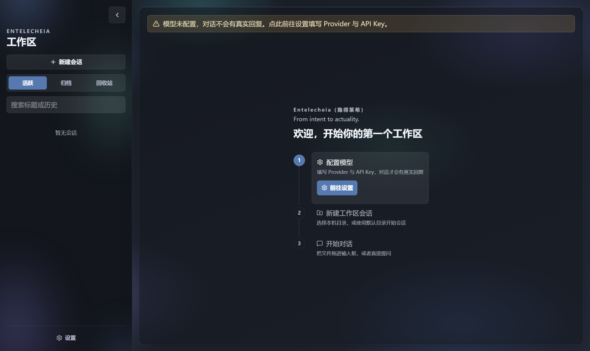

# Entelecheia

> *From intent to actuality.*



Entelecheia 是一个面向文档研究与问答的桌面 Agent 项目。模型自主选择检索、文本读取和页面视觉分析工具；应用运行时负责权限、预算、执行记录与答案交付。文档和状态保存在本地，模型推理可使用远程 API。桌面端使用 Electron + Vue，后端使用 Python。

当前重点是 **L1 文档任务**：围绕一次用户请求，模型通过多步工具调用收集材料、组织回答。项目仍在开发中。

[开始使用](QUICKSTART.md) · [合成文档示例](examples/document_qa/README.md) · [架构与源码导览](ARCHITECTURE.md) · [实验结果](#阶段性评测与能力表现)

## 可以用它做什么

- 绑定本地工作目录或上传文档，围绕 PDF、DOCX、PPTX、Markdown 和文本文件提问。
- 由模型选择搜索文档、读取原文、定位页面；配置视觉模型后，可进一步分析页面和图表。
- 在对话中查看工具活动，结合持久执行记录核对来源、调用和错误。
- 在授权 Project 的 `output/` 下新建文本产物；当前默认能力不允许覆盖已有用户文件。

第一次体验可使用仓库提供的[三页合成手册](examples/document_qa/README.md)：完成一次信息查找、一次跨页综合，再检查模型是否能如实说明文档未提供的信息。

## 核心设计

| 设计 | 实际做法 |
| --- | --- |
| 模型决策与运行时执行分开 | 模型提出计划和工具调用；运行时（Host）检查权限、输入与执行状态，再调用工具和记录结果 |
| 有界上下文与持久结果 | 默认只投影前一步工具批次的正文；计划、工作笔记维持连续性，更早的完整结果可按需回读 |
| 文档共享、会话隔离 | 同一 Project 复用文件版本、解析块和索引；各 Session 分别保存历史、权限与执行状态 |
| 检索与失败可检查 | BGE-M3 Dense / learned sparse / BM25 召回，RRF 融合及 BGE reranker 重排；记录实际方法、来源版本与失败 |

实现入口和设计代价见 [ARCHITECTURE.md](ARCHITECTURE.md)。

## 阶段性评测与能力表现

围绕 L1 文档任务，项目已完成两轮 DocBench 开发子集实验，覆盖文本问答、多模态理解、元数据查询和文档无法回答的问题。**关闭验证门一轮（2026-09-14）在 123 题上全部完成回答交付、后台收尾与进程正常退出**；DeepSeek Flash、Astra、Opus 5 三位裁判的正确率分别为 **78.86%、83.74%、86.18%**。

### 样本与模型

本页所有成绩与完成率统一使用 **123 题、123 份文档**。原选集共 125 题，其中 **`docbench:26:4`、`docbench:37:4` 需要联网检索外部或动态信息**，超出本轮仅使用本地文档、未提供联网工具的能力范围，因此从两轮的计分与比例分母中一并剔除。其余题目即使发生读取失败、链路失败或回答错误，仍计入这 123 题。

**两轮实验的任务主模型与 DeepSeek 裁判均使用 DeepSeek Flash，未开启思考模式**。另外两位裁判为 **Astra（Codex）** 与 **Opus 5（CC）**，下表分别展示三者的判断。

开启验证门一轮的视觉模型为 `qwen3-vl-30b-a3b-instruct`；关闭验证门一轮改用 `qwen3-vl-235b-a22b-instruct`。

### 总体结果


| 实验 | DeepSeek Flash | Astra | Opus 5 |
| --- | ---: | ---: | ---: |
| 开启验证门 | 91 / 123（73.98%） | 99 / 123（80.49%） | 100 / 123（81.30%） |
| 首轮链路失败 8 题补跑合并 | 96 / 123（78.05%） | 104 / 123（84.55%） | 105 / 123（85.37%） |
| 关闭验证门 | 97 / 123（78.86%） | 103 / 123（83.74%） | 106 / 123（86.18%） |

### 开启验证门 + 补跑：各类文档问题的表现

采用首跑与 8 道链路失败题补跑的合并结果，与下方关闭验证门一轮使用相同的四种题型、排列顺序和计分分母。两道联网题仍从 Unanswerable 中剔除。

| 题型 | DeepSeek Flash | Astra | Opus 5 |
| --- | ---: | ---: | ---: |
| 文本问答（Text） | 43 / 50（86.00%） | 46 / 50（92.00%） | 47 / 50（94.00%） |
| 多模态理解（Multimodal） | 19 / 25（76.00%） | 20 / 25（80.00%） | 21 / 25（84.00%） |
| 元数据查询（Metadata） | 17 / 25（68.00%） | 17 / 25（68.00%） | 16 / 25（64.00%） |
| 文档无法回答（Unanswerable） | 17 / 23（73.91%） | 21 / 23（91.30%） | 21 / 23（91.30%） |

### 关闭验证门一轮：各类文档问题的表现

| 题型 | DeepSeek Flash | Astra | Opus 5 |
| --- | ---: | ---: | ---: |
| 文本问答（Text） | 46 / 50（92.00%） | 47 / 50（94.00%） | 47 / 50（94.00%） |
| 多模态理解（Multimodal） | 19 / 25（76.00%） | 20 / 25（80.00%） | 22 / 25（88.00%） |
| 元数据查询（Metadata） | 17 / 25（68.00%） | 17 / 25（68.00%） | 17 / 25（68.00%） |
| 文档无法回答（Unanswerable） | 15 / 23（65.22%） | 19 / 23（82.61%） | 20 / 23（86.96%） |

**文本问答是本轮正确率最高的题型，三位裁判均给出 92% 以上的正确率。** 多模态题已能完成多数任务，图表细节、全文统计和元数据判断仍有改进空间。Unanswerable 考察能否识别文档未提供足够信息并合理拒答；上面两道需要联网的题已从这一类中剔除，其余 23 题保留计分。

### 链路完成情况

| 实验 | 完成回答交付 | 未完成交付 |
| --- | ---: | ---: |
| 开启验证门一轮 · 首跑 | 115 / 123（93.50%） | 8 / 123（6.50%） |
| 开启验证门一轮 · 首跑 + 8 题补跑合并 | 123 / 123（100%） | 0 / 123（0%） |
| **关闭验证门一轮 · 单次运行** | **123 / 123（100%）** | **0 / 123（0%）** |

开启验证门一轮首跑的 8 道交付失败分别为：模型传输失败 3 题、验证失败 4 题、工具完成状态未确认 1 题。

### 逐题证据与问题分析

| 想进一步看什么 | 入口 |
| --- | --- |
| 关闭验证门一轮的运行配置、回答、工具调用与评分 | [123 题实验档案](evals/docbench/previous_results/gate_off_highland235b_123/README.md) |
| 关闭验证门一轮的评审汇总、评分分歧与 badcase | [本轮分析总览](evals/docbench/previous_results/gate_off_highland235b_123/reviews/README.md) · [Astra](evals/docbench/previous_results/gate_off_highland235b_123/reviews/codex/REVIEW.md) · [Opus 5](evals/docbench/previous_results/gate_off_highland235b_123/reviews/claude/REVIEW.md) |
| 开启验证门一轮的三位裁判结果与分项统计 | [开启验证门一轮评测分析](evals/docbench/previous_results/first_gate_on_125/analysis/EVALUATION_REVIEW.md) · [逐题统计 JSON](evals/docbench/previous_results/showcase_125.summary.json) |
| 开启验证门一轮链路失败的具体原因 | [链路失败分析](evals/docbench/previous_results/first_gate_on_125/analysis/FAILURE_ATTRIBUTION.md) |

<details>
<summary>统计口径与实验说明</summary>

- 开启验证门一轮档案保留原选集的 125 题记录；本页从逐题数据排除上述两道联网题后重新计算，两个实验比较的是同一组 123 题。8 题补跑仅替换各自首跑结果，未增加计分题数。
- 三列裁判分数分别汇总，不逐题选取最高分。Astra 关闭验证门一轮采用评审档案的按 PDF 内容校准列（103 题，包含两道参考答案纠错）；评分依据与争议见[本轮分析总览](evals/docbench/previous_results/gate_off_highland235b_123/reviews/README.md)。这些判断来自模型评审，其中存在可见其他评审意见的非盲分析，不是独立人工金标。
- 这是用于迭代的开发子集，非严格未见测试集，也不是 DocBench 官方榜单成绩。两轮对应各自归档的源码与配置快照；当前代码变更的效果需要另行实测。
- 关闭验证门一轮与开启验证门一轮补跑合并结果相比，三位裁判的判对题数变化为 +1、−1、+1，正确率整体接近。验证门与视觉模型同时变化，尚不能将差异单独归因于其中一项；目前也没有与裸模型、DSH 或 BM25-only 的同配置对照。

</details>

### 如何自己核查

- **不调用模型**：阅读公开摘要、逐题回答、工具调用和评分，复算统计与检查失败链路；独立重判仍需另取原 PDF/QA，公开副本省略文档正文。
- **先跑一题**：按[评测运行手册](evals/docbench/docs/formal_l1_eval_runbook.md)准备授权数据、模型和凭据，使用仓库内入口分别 `run`、`score`。生成不会自动评分。
- **扩大实验**：使用新 run ID 和隔离的仓库外评测目录；同题当前代码重跑是新实验，不是历史源码的精确复现。

原始 PDF、QA、未经清理的完整轨迹与数据库不随仓库分发；回答、调用/失败、评分和开销以审阅后的公开副本提供。数据准备、配置核验、真实生成和评分分别有自己的前提；`validate` 成功不代表已能跑真实 API。

## 快速开始

目前完整安装面向 **macOS Apple Silicon（arm64）**。需要 Git、网络和磁盘空间；本地检索模型约占 4–5 GB，此外还需运行时和应用依赖。

```bash
git clone https://github.com/Rising404/entelecheia_agent.git
cd entelecheia_agent
./scripts/bootstrap-local-runtime.sh
.venv/bin/python scripts/prepare-local-models.py download
.venv/bin/python scripts/prepare-local-models.py check
PERSONAGRAPH_DOCUMENT_ENGINE=native ./frontend/start-electron.command
```

启动后，在“设置 → 任务模型配置”填写并启用自己的模型配置，再上传[合成示例](examples/document_qa/README.md)提问。默认 `mock` 只返回占位结果；页面视觉分析需要另行配置视觉模型。

Provider 密钥保存在本地明文配置中，任务所需的摘录与页面图像可能发送给你配置的服务商，真实调用可能收费。首次配置、独立状态预览、模型检查、其他平台限制与故障排查统一见 [QUICKSTART.md](QUICKSTART.md)。

### 输入与处理范围

| 范围 | 当前状态 |
| --- | --- |
| 文本型 PDF、DOCX、PPTX、MD/TXT | 基础文档范围；解析有资源与覆盖限制，不保证复杂排版无损 |
| 扫描页、图片和复杂图表 | 需要相应视觉能力；请求成功不等于内容完整或理解正确 |
| Docling / 旧 Office / XLSX / L2 | Docling 增强解析是实验路径；旧 `.doc` / `.ppt`、XLSX 不属基础承诺；L2 图式编排保留部分代码，但不在本次展示与评测范围 |

## 继续阅读与开发

| 你想了解 | 入口 |
| --- | --- |
| 第一次安装、配置与文档问答 | [QUICKSTART.md](QUICKSTART.md) |
| 一个可公开、可重建的小型文档任务 | [examples/document_qa](examples/document_qa/README.md) |
| 执行主干、状态边界和源码阅读路线 | [ARCHITECTURE.md](ARCHITECTURE.md) |
| 安装闭包、锁文件与本地模型 | [scripts/DEPENDENCIES.md](scripts/DEPENDENCIES.md) |
| 评测入口、隔离及复现边界 | [evals/README.md](evals/README.md) |
| 修改与定向验证规范 | [AGENTS.md](AGENTS.md) · [测试说明](tests/README.md) |

源码按职责分为 `frontend/`、`src/personagraph/`、`evals/`、`tests/` 与 `scripts/`。默认测试与真实 API/设备检查分开，不把 mock 通过当作实际模型验证。发布前还需执行仓库隐私检查；`.gitignore` 不能清除已经提交的秘密。

### 内部命名与许可

内部包名 `personagraph`、`PERSONAGRAPH_*` 环境变量和部分存储标识仍保留。它们是早期未能及时修改带来的历史遗留问题，项目不支持 persona subsystem，`persona_id` 仅是内部存储兼容字段，不提供角色选择或 persona prompt 注入。

源码使用 [Apache-2.0](LICENSE)，第三方说明见 [NOTICE](NOTICE)。模型权重与第三方文档遵守各自许可，不因本仓库开源而自动获得再分发许可。
